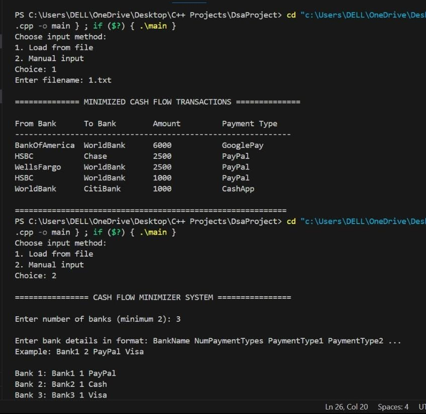
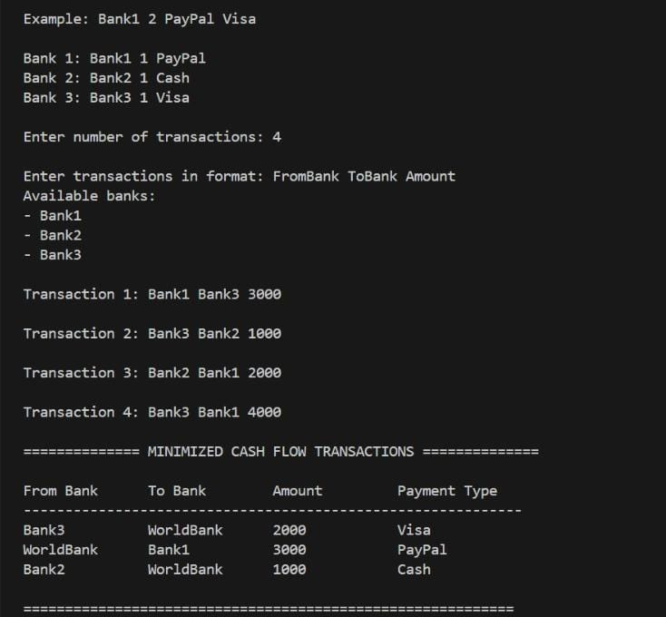

# Cash Flow Minimizer System

A C++ application that optimizes financial transactions between multiple banks by minimizing the number of transactions while considering payment type constraints.

## Table of Contents
- [Introduction](#introduction)
- [Features](#features)
- [Installation](#installation)
- [Usage](#usage)
- [Data Structures](#data-structures)
- [Algorithms](#algorithms)
- [Complexity Analysis](#complexity-analysis)
- [Example](#example)
- [Contributing](#contributing)

## Introduction

The Cash Flow Minimizer System is a sophisticated financial application designed to optimize and simplify complex networks of financial transactions between multiple banks. It minimizes the total number of transactions needed to settle all accounts while considering constraints of different payment types supported by each bank.

Key aspects:
- Handles multiple banks with unique payment type support
- Minimizes transaction count using greedy algorithms
- Supports both file and manual input
- Handles payment type constraints with intermediary "WorldBank" fallback
- Consolidates similar transactions

## Features

- **Transaction Minimization**: Reduces the number of transactions needed to settle all debts
- **Payment Type Handling**: Ensures transactions only use mutually supported payment methods
- **WorldBank Integration**: Acts as intermediary when banks don't share payment types
- **Input Flexibility**: Supports both file input and manual entry
- **Transaction Consolidation**: Combines multiple transactions between the same banks
- **Efficient Algorithms**: Uses priority queues and greedy approach for optimization

## Installation

1. Clone the repository:
   ```bash
   git clone https://github.com/ShreyaArora31/Cash-Flow-Minimizer.git
   cd Cash-Flow-Minimizer
   ```

2. Compile the C++ files:
   ```bash
   g++ *.cpp -o cashflowminimizer
   ```

## Usage

### File Input
1. Create a transaction file (see format below)
2. Run the program:
   ```bash
   ./cashflowminimizer < input_file.txt
   ```

### Manual Input
1. Run the program:
   ```bash
   ./cashflowminimizer
   ```
2. Follow the interactive prompts

### File Format
```
3               // Number of banks
Bank1 2 PayPal Visa
Bank2 1 PayPal
Bank3 2 Visa Mastercard
2               // Number of transactions
Bank1 Bank2 100
Bank2 Bank3 50
```

## Data Structures

- `Bank` class: Stores bank name, balance, and supported payment types
- `Transaction` class: Represents financial transactions between banks
- Key containers:
  - `vector<Bank>`: Main bank information storage
  - `unordered_map<string, int>`: Fast bank name to index lookup
  - `set<string>`: Unique payment types
  - `priority_queue`: Efficient debtor/creditor management
  - `vector<Transaction>`: Transaction storage

## Algorithms

1. **Balance Calculation**:
   - Computes net balance for each bank
   - Time Complexity: O(T), where T is number of transactions

2. **Transaction Minimization**:
   - Uses greedy algorithm with priority queues
   - Time Complexity: O(B log B + T), where B is number of banks

3. **Transaction Consolidation**:
   - Combines similar transactions
   - Time Complexity: O(T²)

## Complexity Analysis

- **Best Case**: O(B log B + T)
- **Worst Case**: O(B log B + T²)
- **Average Case**: O(B log B + T log T)

## Example

Sample Output:
```
======================== MINIMIZED CASH FLOW TRANSACTIONS ========================

| From Bank | To Bank | Amount | Payment Type |
|-----------|---------|--------|--------------|
| Bank1     | Bank3   | 150    | Visa         |
| Bank2     | Bank1   | 100    | PayPal       |

================================================================================
```

## Contributing

Contributions are welcome! Please fork the repository and submit a pull request.
